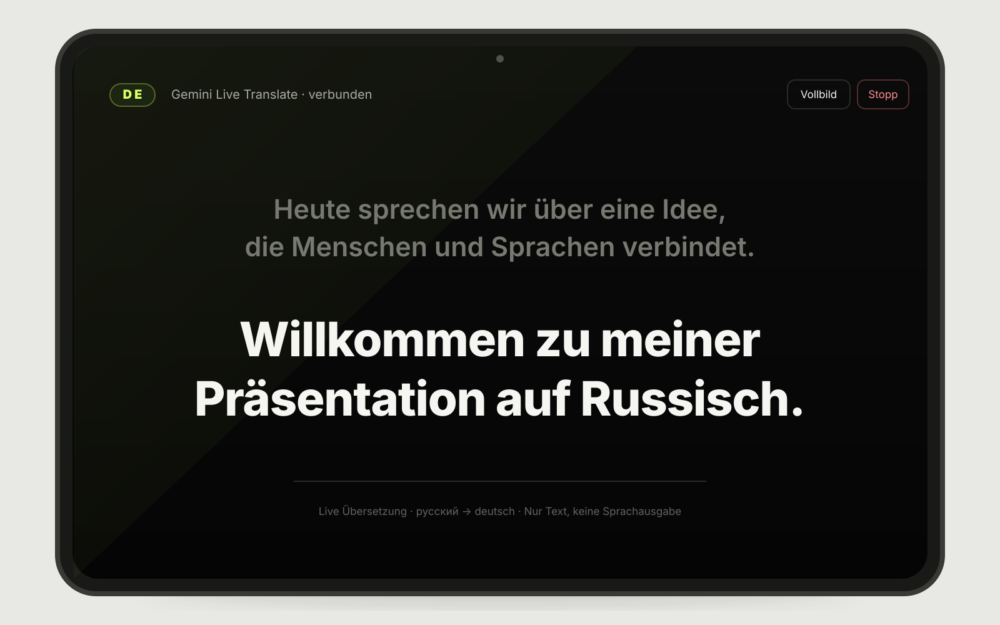

# Live Translate Display

Минималистичное iPad-приложение для показа перевода презентации в реальном времени. Говорите по-русски — немецкий текст появляется крупными буквами на экране для аудитории. Озвучка перевода отключена.

[English README](../README.md) · [Публичная демо-страница](https://egore4606.eu/LiveTranslate/)

> **Важно:** демо размещено публично. Для чувствительной презентации лучше развернуть собственный relay и использовать отдельный ограниченный Gemini API key.

## Возможности

- Русская речь → немецкие субтитры через Gemini Live Translate.
- Крупный центрированный текст для iPad, поставленного экраном к аудитории.
- Ограниченное окно свежего текста: длинная непрерывная речь не вытесняет новые строки за пределы экрана.
- Без озвучки, аналитики, cookies и базы данных.
- Полноэкранный режим и запрос screen wake lock, если браузер поддерживает их.
- Небольшой Node.js WebSocket relay, который не помещает ключ Gemini в URL браузера.

## Визуальный preview

*Это иллюстративный preview интерфейса с демонстрационным немецким текстом, а не запись реальной сессии.*

## Быстрый запуск

1. Откройте страницу через HTTPS в Safari на iPad.
2. Создайте ключ в [Google AI Studio](https://aistudio.google.com/apikey).
3. Вставьте ключ и нажмите **Начать перевод**.
4. Разрешите микрофон, затем включите **Vollbild**.
5. Поверните iPad к аудитории и говорите по-русски.

Проект сейчас использует немецкий (`de`) и модель `gemini-3.5-live-translate-preview`. Доступность модели, квоты и цены определяет Google.

## Архитектура и безопасность

Статический интерфейс передаёт аудио через same-origin WSS на собственный relay. Relay открывает upstream-соединение к Gemini с заголовком `x-goog-api-key`, пересылает сообщения и не сохраняет ключ или аудио. В production relay должен слушать только localhost и быть доступен через HTTPS reverse proxy.

Ключ не входит в исходники, URL, browser storage или репозиторий. Production-процесс отказывается запускаться без `ALLOWED_ORIGIN`, чтобы не забыть проверку Origin. Шаблон systemd намеренно не содержит реальных путей, пользователей или доменов сервера.

Подробности self-hosting, тестов и ограничений находятся в [основном README](../README.md).

## Лицензия

[MIT License](../LICENSE).
